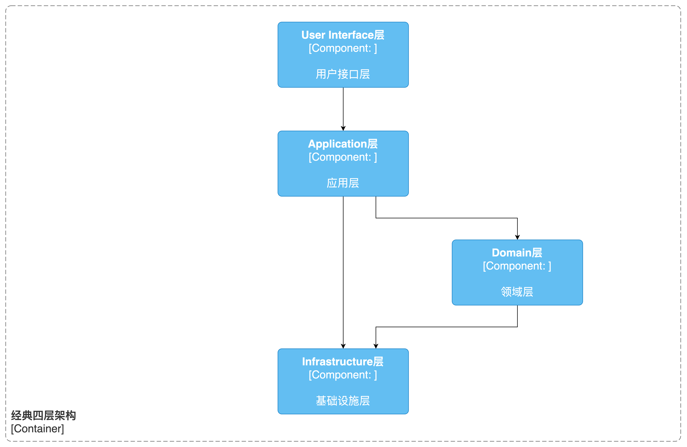
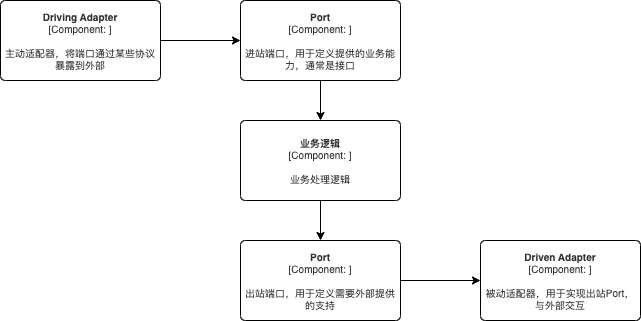
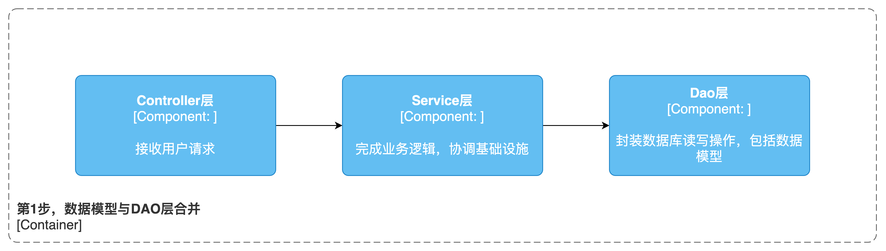
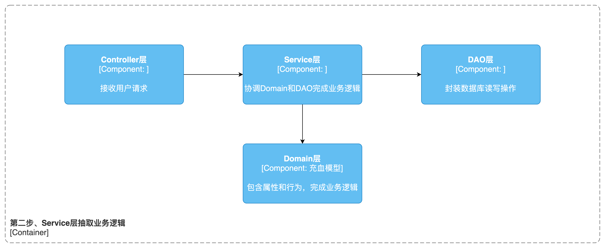
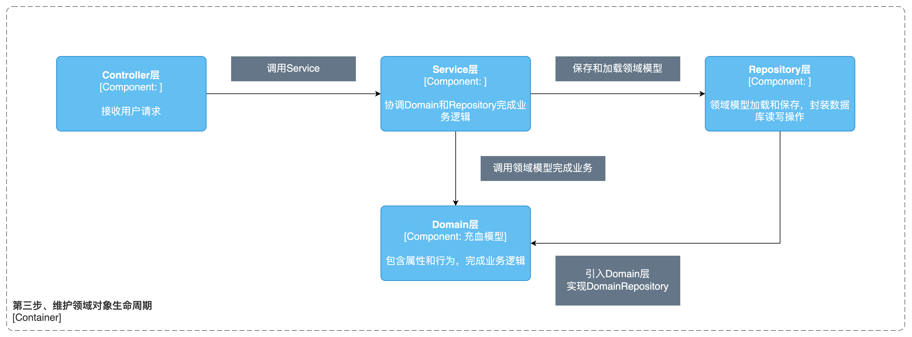
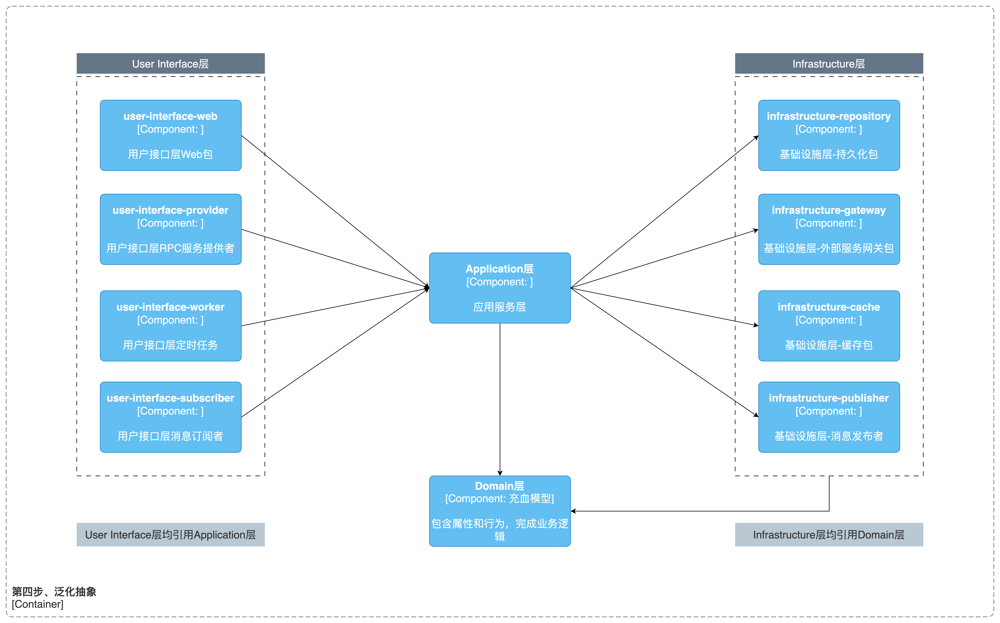
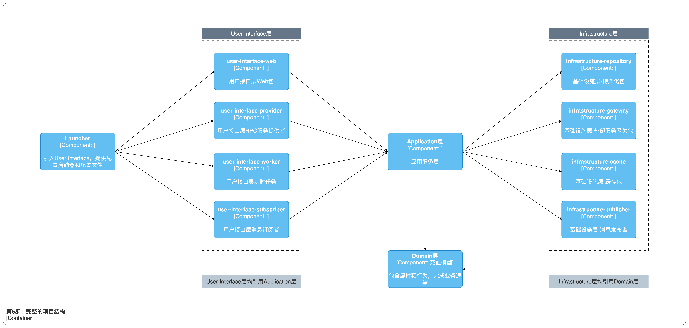
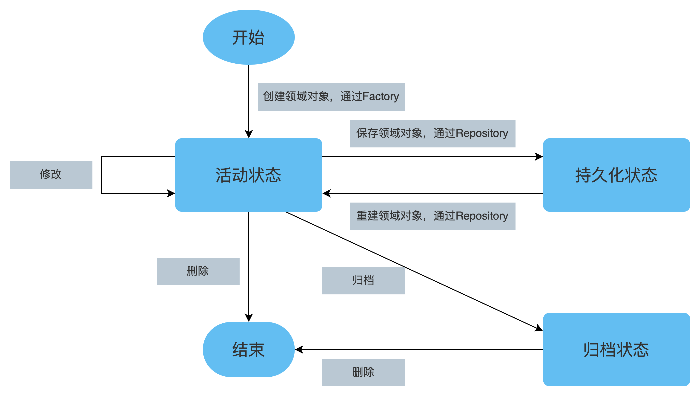
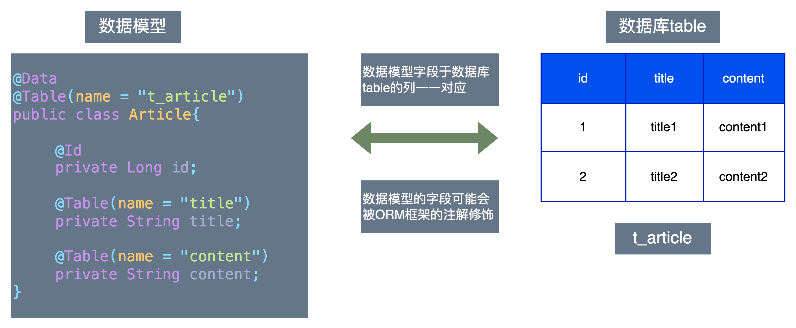

# 第 2 章 应用架构

本章我们将解决领域驱动设计落地的应用架构问题。我们会首先讨论贫血模型和充血模型，在对二者有理解的基础上，探讨经典贫血三层架构以及 DDD 常见的应用架构。读者要清楚不管是和种架构，都是对系统的描述，可能在模块、代码的组织上有区别，但是本质上描述的是同一个事物。

本书将带领读者从贫血三层架构出发，演绎出我们自己的应用架构，本书全书案例均采用这个架构进行开发。之后，我们将探讨领域对象的生命周期，可以说理解了领域对象的生命周期，基本上就理解了领域对象的使用方式。本章最后，我们还会探索对象的在应用架构各层进行的类型转换。

## 2.1 贫血模型和充血模型

### 2.1.1 对象的属性和行为

在学习贫血模型和充血模型之前，我们首先要理解对象的属性和对象的行为这两个概念。

对象的属性：指的是对象的内部状态，通常表现为类的属性，如下文 Computer 类的 os 属性。

对象的行为：指的是对象具备的能力，通常表现为类的方法，如下文 VideoPlayer 类的 play 方法。

### 2.1.2 贫血模型

贫血模型指的是只有属性没有行为的模型。我们目前开发中经常用的 Java Bean，实际上就是贫血模型。例如下面的 Computer 类：

```java
/**
 * Computer类中只有属性，没有行为，所以是贫血模型
 */
@Data
public class Computer {
    /**
     * 操作系统
     */
    private String os;
    /**
     * 键盘
     */
    private String keyboard;
    //……其他属性
}
```

### 2.1.3 充血模型

充血模型是指既有属性也有行为的模型。

如果我们采用面向对象的思想去建模，则产出的模型应该既有属性，也有行为，那么这种模型就是充血模型。

例如下面的 VideoPlayer 类，既有属性（playlist），也有行为（play 方法），则 VideoPlayer 是充血模型。

```java
/**
 * 视频播放器
 */
@Data
public class VideoPlayer {
    /**
     * 播放列表
     */
    public List<String> playlist;

    /**
     * 播放节目
     */
    public void play() {
        for (String v : playlist) {
            System.out.printf("正在播放：" + v);
        }
    }
}
```

### 2.1.4 DDD 对模型的要求

由于使用贫血模型写代码太方便了，因此大部分 Java 程序员习惯了使用贫血模型。贫血模型的使用方式大概是这样的：先通过 ORM 框架从数据库查询数据，然后在 Service 层的方法中操作这些数据对象完成业务逻辑，然后 Service 层中调用 ORM 框架将之行结果更新到数据库中。

虽然贫血模型使用方便，但是贫血模型实现的代码通常会存在一些问题。

在业务逻辑的封装上，贫血模型只是提供了业务数据的容器，并不会发生业务行为。贫血模型向 Service 方法公开这些属性， Service 方法通过操作这些属性完成业务逻辑。Service 方法实际上承担了实现所有业务逻辑的责任，这就导致业务知识散落到 Service 层各个方法中，我们经常看到某个业务校验的逻辑在每个 Service 方法里面都出现一次，就是业务知识没有得到封装造成的。

在业务逻辑与技术实现的分离上，贫血模型实现的 Service 层一般不会对二者进行分离。Service 层方法会和外部服务和中间件进行交互，例如 RPC 调用、缓存、事务控制等，在业务代码中夹杂着技术操作。

由此可见，贫血模型的代码是很难维护的，很多贫血模型构建的系统经过多次迭代之后，里面的 Service 方法就变得异常臃肿，难以持续地演化。在本书前文，作者提到贫血模型并不能真正实践 DDD，就是因为贫血模型存在这些问题，试想连基本的封装都谈不上，又怎么可能真正产出一个纯粹的面向业务的领域模型？

接下来我们再看充血模型。充血模型拥有完整的属性，同时具备业务行为（即业务方法），充血模型内部封装了完整地业务知识，不存在业务逻辑泄漏的问题。Service 层方法得到充血模型对象后，只要调用充血模型对象上的行为方法，充血模型内部即自行修改对应的状态来完成业务操作。这时候 Service 层方法再也不需要理解领域的业务规则了，也将业务逻辑与技术实现分离了。

以上面的 VideoPlayer 为例，展示充血模型地使用方法，如下。

```java
public class VideoApplicationService {

    public void play() {
        //TODO 1.获得领域对象

        //2. 执行业务操作，Service只需要调用充血模型的行为就能完成业务操作，
        //   不再需要了解播放的逻辑
        videoPlayer.play( );
    }
}
```

可以看到，当采用充血模型的建模方式后，业务逻辑由对应的充血模型进行维护，被很好地封装在模型中，与操作基础设施的代码分离了，Service 方法会变得清晰明了。这样，我们就理解 DDD 要求使用充血模型的合理性了。

## 2.2 经典贫血三层架构

### 2.2.1 常用的经典贫血三层架构

目前业界许多项目使用的架构基本都是贫血三层架构。贫血三层架构将应用分为三层：Controller 层、Service 层、Dao 层。有时候贫血三层架构还会包括 Model 层，但是 Model 层基本上都是贫血模型的数据对象，内部不包含任何逻辑，完全可以将 Model 层合并到 Dao 层。

贫血三层架构的示意图如下。


Controller 层：接受请求，调用 Service 完成业务操作，并将 Service 出参拼装为响应报文向客户端返回。

Service 层：初衷是在 Service 层实现业务逻辑，往往还需要跟基础设施（数据库、缓存、外部服务等）进行交互。

Dao：负责进行数据库读写。

Model 层：贫血模型，往往与数据库的 table 字段一一对应，用于充当数据库读写的数据容器。

其中 Controller 层依赖 Service 层，Service 层依赖 Dao 层，Dao 层依赖 Model 层。

Model 层由于只有普通的贫血对象，往往也会将其合并到 Dao 层，此时只有 Controller 层、Service 层、Dao 层这三层，因而称之为贫血三层架构。

### 2.2.2 贫血三层架构的优点

分层架构具有许多优点：

- 关注点分离

贫血三层架构将系统的不同功能模块分别放置在不同的层次中，使得每个层次只关注自己的责任范围。Controller 层负责接收用户请求并进行请求处理，Service 层负责业务逻辑的处理，Dao 层负责数据的持久化操作。这种分离关注点的设计使得系统更加清晰，易于扩展和维护。

- 复用性强

贫血三层架构将系统的不同功能模块分别放置在不同的层次中，使得每个层次可以独立重用。Controller 层可以通过调用 Service 层提供的接口来处理用户请求，Service 层可以通过调用 Dao 层提供的接口来处理业务逻辑，Dao 层可以通过调用数据库驱动来处理数据持久化操作。这种可复用性的设计使得系统的代码可以更加灵活地组织和重用，有助于提高开发效率。

### 2.2.3 贫血三层架构存在的问题

分层架构具备如此多的优点，所以在开发中被广泛使用。如果我们开发过程中缺乏思考，也会引入一些问题。

- 底层缺乏抽象

我们经常能看到这样的情况：每一层的方法名字都是一样的，并没有体现出“越上层越具体，越底层越抽象”的设计思路。

Controller 层：

```java
public class Controller {

    public void updateTitleById(Param param) {
        service.updateTitleById(param);
    }
}
```

Service 层：

```java
public class Service {

    public void updateTitleById(Param param) {
        dao.updateTitleById(param);
    }
}
```

Dao 层：

```java
public class Dao {

    public void updateTitleById(Param param) {
        //TODO update db
    }
}
```

上面的 Controller、Service、Dao 各层的 updateTitleById 方法中，分别根据根据自己所处的分层，进行了对应的处理。但是，如果 Controller 每增加一个业务方法，那么 Service 和 Dao 都会增加一个对应的方法，也就意味着底层的方法缺乏抽象。

解决的办法也很简单，Service 是具体业务操作的实现，所以在新增业务操作时，增加新的业务方法无可厚非，但是 Dao 层可以抽象出更通用的方法。

- 业务逻辑分散

这个主要是贫血模型造成的。贫血模型对于领域对象的封装程度较低。由于领域对象只包含数据属性，对于复杂的业务逻辑或数据操作，可能需要在 Service 层或 Dao 层中进行处理。这可能导致领域对象的封装程度较低，使得代码变得分散和难以管理。

贫血三层架构将系统的业务逻辑分散在不同的层次中，使得系统的业务逻辑分散、难以维护。例如，某个业务逻辑可能涉及到多个层次的操作，需要在不同的层次之间进行数据传递和协调。这种业务逻辑分散会增加系统的复杂性和维护成本。

## 2.3 DDD 常见的应用架构

### 2.3.1 经典四层架构

经典的四层架构将软件系统分为四个层次，每个层次都有不同的职责和功能。下面我们将详细介绍一下这个经典的四层架构，其架构如下图。



- 第一层：用户接口层

用户接口（User Interface）层是软件系统的最外层，它负责与用户进行交互，接收用户的输入和展示系统的输出。用户界面层通常包括各种图形界面、Web 界面、移动端应用、下游调用方等。

用户界面层不应该包含任何业务逻辑，它只是将用户的请求传递给下一层处理，并将执行结果按照一定的协议进行返回。

- 第二层：应用层

应用层既不包含业务逻辑，也不应该包含任何与具体技术相关的代码，应用层协调领域模型和基础设施层一起完成业务操作。

应用层收到请求后，需要加载领域模型中的聚合根，由聚合根执行业务操作，并将处理结果返回给用户接口层。

- 第三层：领域模型层

领域模型层是软件系统的核心，它负责描述业务领域中的各种概念和规则。领域模型层通常包括各种实体、值对象、领域服务等。

领域模型层应该包含业务逻辑和业务规则，但是不应该包含任何与具体技术相关的代码。

- 第四层：基础设施层

基础设施层是软件系统的最底层，它负责提供各种基础设施支持，如数据库访问、缓存、消息队列、日志等。

基础设施层应该只包含与具体技术相关的代码，不应该包含任何业务逻辑。

### 2.3.2 端口和适配器架构

端口和适配器架构（又称为六边形架构）的核心思想是将业务逻辑从技术细节中解耦，使得业务逻辑能够独立于任何特定的技术实现。端口和适配器架构通过引入两个关键概念来达到这个目标：端口（Port）和适配器（Adapter）。

端口是系统与外部世界进行交互的接口，它定义了系统对外提供的服务以及需要外部提供的支持。“定义系统对外提供的服务”通常是指定义的可以被外部系统调用的接口，将业务逻辑实现在接口的实现类中，这种端口属于进站端口（Inbound Port）。“定义需要外部提供的支持”，是指执行业务逻辑的过程中，有时候需要依赖外部服务（例如从外部服务加载某些数据以用于完成计算），此时定义一个接口，通过调用该接口完成业务逻辑，这种端口属于出站端口（Outbound Adapter）。

适配器则细分为 Driving Adapter 和 Driven Adapter 两种。Driving Adapter，用于对外暴露端口，例如将端口暴露为 RESTful 接口，或者将端口暴露为 RPC 服务；Driven Adapter，用于实现业务逻辑执行过程中需要使用的端口。

六边形架构的整体架构图如下。


端口和适配器之间的交互关系如下图。



主动适配器伪代码如下。

```java
/**
 * 主动适配器，将创建文章的Port暴露为Http服务
 */
@RestController
public class ArticleController {
    @Resource
    private ArticleService service;

    @RequestMapping("/create")
    public void create(DTO dto) {
        service.create(dto);
    }
}
```

进站的端口伪代码如下。

```java
public interface ArticleService {
    /**
     * 端口和适配器架构中的Port，提供创建文章的能力
     * 这是一个进站端口
     * @param dto
     */
    void create(DTO dto);
}
```

出站端口的代码如下。

```java
public interface AuthorServiceGateway {
    /**
     *  端口和适配器架构中的Port，查询作者信息
     *  这是一个出站端口
     * @param authorId
     * @return
     */
    AuthorDto queryAuthor(String authorId);
}
```

被动适配器伪代码如下。

```java
/**
 * 被动适配器
 */
public interface AuthorServiceGatewayImpl implements AuthorServiceGateway {

    /**
     * 作家RPC服务
     */
    @Resource
    private AuthorServiceRpc rpc;

    AuthorDto queryAuthor(String authorId) {
        //拼装报文
        AuthorRequest req = this.createRequest(authorId);
        //执行RPC查询
        AuthorResponse res = rpc.queryAuthor();
        //解析查询结果并返回
        return this.handleAuthorResponse(res);
    }
}
```

## 2.4 应用架构演化

上文讲解了两种常见的 DDD 应用架构：经典四层架构、端口和适配器架构（六边形架构）。架构无优劣高下之分，只要熟练掌握就都是合适的架构。本节我们将从日常的三层架构出发，演绎出我们自己的应用架构。

我们很多项目是基于三层架构的，其结构如图：



我们说三层架构，为什么还画了一层 Model 呢？因为 Model 层只有一些贫血模型对象，都是一些简单的 Java Bean，里面字段和数据库表对应的列（column）一一对应，这样的模型其实是数据模型，有的应用会将其单独出来作为一层，但实际上可以合并到 DAO 层。

接下来我们开始对这个三层架构进行抽象精炼。

### 2.4.1 第一步、数据模型与 DAO 层合并

为什么数据模型要与数据访问层合并呢？

首先，数据模型是贫血模型，数据模型中不包含业务逻辑，只作为装载模型属性的容器；

其次，数据模型与数据库表（table）的列（column）是一一对应的，数据模型最主要的应用场景就是持久层用来进行数据库读写，将数据库查询结果封装为数据模型给 Service 层返回，供 Service 获取模型属性以执行业务；

最后，数据模型的 Class 或者属性字段上，通常带有 ORM 框架的一些注解，跟持久层联系非常紧密，可以认为数据模型就是持久层拿来查询或者持久化数据的，数据模型脱离了持久化层，意义不大。

此时的架构图如下。



### 2.4.2 第二步、Service 层抽取业务逻辑

下面是一个常见的 Service 方法的伪代码，既有缓存、数据库的调用，也有实际的业务逻辑，整体过于臃肿，要进行单元测试更是无从下手。

```java
public class Service {

    @Transactional
    public void bizLogic(Param param) {

        //校验不通过则抛出自定义的运行时异常
        checkParam(param);
        //查询数据模型
        Data data = queryOne(param);

        //根据业务条件执行对应的操作
        if (condition1 == true) {
            biz1 = biz1(param.getProperty1());
            data.setProperty1(biz1);
        } else {
            biz1 = biz11(param.getProperty1());
            data.setProperty1(biz1);
        }


        //省略其他条件处理逻辑

        //省略一堆set方法

        //更新数据库
        mapper.updateXXXById(data);
    }
}
```

这是典型的事务脚本的代码：先做参数校验，然后通过 biz1、biz2 等子方法做业务，并将其结果通过一堆 Set 方法设置到数据模型中，再将数据模型更新到数据库。

由于所有的业务逻辑都在 Service 方法中，造成 Service 方法非常臃肿，Service 需要了解所有的业务规则，同样的一条规则很有可能在每个方法里面都出现，例如 if(condition1=true)可能每个方法都会判断一次。

Service 方法还要协调基础设施进行相关的支持，例如查询数据模型、更新执行结果等。我们知道，专业的事情就该让专业的人干。既然业务逻辑是跟具体的业务场景相关的，我们想办法把业务逻辑从 Service 方法里提取出来，形成一个模型，让这个模型的对象去执行具体的业务逻辑。这样 Service 方法就不用再关心里面的 if/else 业务规则，只需要给业务模型执行的舞台，并提供基础设施完成用例即可。

将业务逻辑抽形成模型，这样的模型就是领域模型的雏形。

我们先不管领域模型怎么得到，总之，拿到 Service 方法的入参之后，我们通过某种途径得到一个模型，我们让这个模型去做业务逻辑，最后执行的结果也都在模型里，我们再将模型回写数据库，当然，怎么写数据库的我们也先不管。

抽取之后，将得到如下的伪代码：

```java
public class Service {

    public void bizLogic(Param param) {

        //如果校验不通过，则抛一个运行时异常
        checkParam(param);
        //加载模型
        Domain domain = loadDomain(param);
        //调用外部服务取值
	  SomeValue   someValue =
                    this.getSomeValueFromOtherService(param.getProperty2());
        //模型自己去做业务逻辑，Service不关心模型内部的业务规则
        domain.doBusinessLogic(param.getProperty1(), someValue);
        //保存模型
        saveDomain(domain);
    }
}
```

根据代码，我们已经将业务逻辑抽取出来了，领域相关的业务规则封闭在领域模型内部。此时 Service 方法非常直观，就是获取模型、执行业务逻辑、保存模型，再协调基础设施完成其余的操作。

抽取完领域模型后，我们工程的结构如下图：



### 2.4.3 第三步、维护领域对象生命周期

在这一步，我们将对上一步的 loadDomain、saveDomain 这两个方法进行讨论，这两个方法跟领域对象的生命周期息息相关。

关于领域对象的生命周期的知识，我们将在“2.5 领域对象的生命周期”中详细讲解。

不管是 loadDomain 还是 saveDomain，我们一般都要依赖于数据库或者其他中间件，所以这两个方法对应的逻辑，肯定是要跟 DAO 产生联系的。

保存或者加载领域模型，我们可以抽象成一种组件，通过这种组件进行封装数据库操作，这种组件就是 Repository，在 Repository 中调用 DAO 完成领域模型加载和持久化操作。

注意，Repository 是对加载或者保存领域模型（这里指的是聚合根，因为只有聚合根才会有 Repository）的抽象，可以对上层屏蔽领域模型持久化的细节，因此其方法的入参或者出参，一定是基本数据类型或者领域内定义的类型，不能是数据库表对应的数据模型。由于这里的 Repository 操作的是领域模型，为了与某些 ORM 框架的 Repository 接口区分开，我们将其命名为 DomainRepository。

以下是 DomainRepository 的伪代码：

```java
public interface DomainRepository {

    void save(AggregateRoot root);

    AggregateRoot load(EntityId id);
}
```

既然 DomainRepository 与底层数据库有关联，但是我们现在 DAO 层并没有引入 Domain 这个包，DAO 层自然无法提供 DomainRepository 的实现，我们初步考虑可以将这个 DomainRepository 实现在 Service 中。

我们再推敲推敲，如果我们在 Service 中实现 DomainRepository，势必需要在 Service 中操作数据模型：查询出来数据模型再封装为领域模型、或者将领域模型转为数据模型再通过 ORM 保存，这个过程不该是 Service 层关心的，我们的 Service 层应该只关注领域模型。

所以，我们决定在 DAO 层直接引入 Domain 包，并在 DAO 层提供 DomainRepository 接口的实现，DAO 层的 Mapper 查询出数据模型之后，封装成领域模型供 DomainRepository 返回。

这样调整之后，DAO 层不再向 Service 返回数据模型，而是返回领域模型，这就隐藏了数据库交互的细节，我们也把 DAO 层换个名字称之为 Repository。

现在，我们项目的架构图是这样的了：



### 2.4.4 第四步、泛化抽象

在第三步中，我们的架构图已经跟经典四层架构非常相似了，我们再对某些层进行泛化抽象。

- Infrastructure

Repository 仓储层其实属于一种基础设施，只不过其职责是持久化和加载聚合，所以，我们将 Repository 层改名为 infrastructure-persistence，即基础设施层持久化包。

之所以采取这种 infrastructure-XXX 的格式进行命名，是由于 Infrastructure 可能会有很多的包，分别提供不同的基础设施支持。

例如：一般的项目还有可能需要引入缓存，我们就可以采用类似的命名，再加一个名字叫 infrastructure-cache 的包。

对于外部的调用，DDD 中有防腐层的概念。防腐层可以将外部模型通过防腐层进行隔离，避免污染本地上下文的领域模型。我们使用入口（Gateway）来封装对外部系统或资源的访问（详细见《企业应用架构模式》，18.1 入口（Gateway）），因此将对外调用这一层称之为 infrastructure-gateway。

注意：Infrastructure 层的门面接口都应先在 Domain 层定义，其方法的入参、出参，都应该是领域模型（实体、值对象）或者基本类型，不应该将外部接口的数据类型作为参数类型或者返回值类型。

- User Interface

Controller 层其实就是用户接口层，即 User Interface 层。

Controller 层的名字有很多，有的叫 Rest，有的叫 Resource，考虑到我们这一层不只是有 RESTful 接口，还可能还有一系列 Web 相关的拦截器，所以我一般比较称之为 Web。

因此，我们将其改名为 user-interface-web，即用户接口层的 Web 包。

同样，我们可能会有很多的用户接口，但是他们通过不同的协议对外提供服务，因而被划分到不同的包中。我们如果有对外提供的 RPC 服务，那么其服务实现类所在的包就可以命名为 user-interface-provider。

有时候引入某个中间件既会增加 Infrastructure 也会增加 User Interface。

例如，如果引入 Kafka 就需要考虑一下，如果是给 Service 层提供调用的，例如逻辑执行完发送消息通知下游，那么我们再加一个包 infrastructure-publisher；如果是消费 Kafka 的消息，然后调用 Service 层执行业务逻辑的，那么就可以命名为 user-interface-subscriber。

- Application

至此，Service 层目前已经没有业务逻辑了，业务逻辑都在 Domain 层去执行了，Service 只是提供了应用服务，协调领域模型、基础设施层完成业务逻辑。

所以，我们把 Service 层改名为 Application 层或者 Application Service 层。

经过第四步的抽象，其架构图为：



### 2.4.5 第五步、完整的项目结构

将第四步中出现的包进行整理，并加入启动包，我们就得到了完整的 maven 包结构。

此时还需要考虑一个问题，我们的启动类应该放在哪里？由于有很多的 User Interface，所以启动类放在任意一个 User Interface 中都不合适，并且放置再 Application Service 中也不合适，因此，启动类应该存放在单独的模块中。又因为 application 这个名字被应用层占用了，所以将启动类所在的模块命名为 launcher。

一个项目可以存在多个 launcher，按需引用 User Interface。launcher 包需要提供启动类以及项目运行所需要的配置文件，例如数据库配置等。

包结构如图所示：



至此，DDD 项目的整体结构基本讲完了。

## 2.5 领域对象的生命周期

### 2.5.1 领域对象的生命周期

《领域驱动设计》一书的第六章讲解了领域对象的生命周期，如下图：


这个状态图是理解领域对象生命周期以及领域对象与各个组件交互的关键。

领域对象的生命周期包括创建、重建、归档和删除等过程，接下来我们分别进行探讨。

### 2.5.2 领域对象的创建过程

创建的过程是领域对象生命周期的首个阶段。在这个阶段，我们需要实例化领域对象，并设置其初始状态、属性和关联关系。
在创建领域对象时，我们通常需要提供一些必要的参数或初始化数据，用于设置其初始状态，创建的过程由 Factory 来支持。

Factory 其伪代码如下。

```java
/**
 * 通过Factory创建领域对象
 */
public interface ArticleDomainFactory {
    ArticleEntity newInstance(ArticleTitle articleTitle,
                    ArticleContent articleContent);
}

/**
 * ArticleDomainFactory的实现类
 */
@Component
public class ArticleDomainFactoryImpl implements ArticleDomainFactory{

    /**
     * IdService是一个Id生成服务
     */
    @Resource
    IdService idService;

    public ArticleEntity newInstance(ArticleTitle articleTitle,
                            ArticleContent articleContent){
        ArticleEntity entity = new ArticleEntity();
        //为新创建的聚合根赋予唯一标识
        entity.setArticleId(new ArticleId(idService.nextSeq()));
        entity.setArticleTitle(articleTitle);
        entity.setArticleContent(articleContent);
        //TODO 其余逻辑

        return entity;
    }
}
```

在 Application 层调用 Factory 进行领域对象创建，如以下伪代码。

```java
/**
 * ArticleEntity的唯一标识，是一个值对象
 */
@Getter
public class ArticleId{

    private final String value;

    public ArticleId(String input){
        this.value=input;
    }
}
```

```java
@Service
public class AppilcationService{

    @Resource
    private Factory factory;

    public void createArticle(Command cmd){

        //创建ArticleTitle值对象
        ArticleTitle title = new ArticleTitle(cmd.getTitle());
        //创建ArticleContent值对象
        ArticleContent content = new ArticleContent(
cmd.getContent());
        //通过Factory创建ArticleEntity
        ArticleEntity root= factory.newInstance(title,content);
        //TODO 省略后续操作
    }
}
```

### 2.5.3 领域对象的保存过程

领域对象的保存过程，即将活动状态下的领域对象持久化到存储设备中，这里的存储设备可能是数据库或者其他媒介。领域对象的保存过程是通过 Repository 完成的。

在 Repository 提供的 save 方法中，需要将领域模型转成数据模型，并将数据模型持久化到数据库。

关于 Repository 实现领域对象的保存，我们将在“5.2 Repository”中详细介绍，在此仅需要清楚领域对象是通过 Repository 进行持久化的。

### 2.5.4 领域对象的重建过程

重建是领域对象生命周期中的一个重要过程，用于恢复、更新或刷新领域对象的状态。创建的过程由 Factory 来支持，领域对象重建的过程则是通过 Repository 来支持。

领域对象的重建过程这包括以下几种情况：

- 数据持久化和恢复

当我们从持久化存储（如数据库、文件系统等）中加载领域对象时，需要使用保存的状态数据对领域对象进行重建。

在这种情况下，我们通过 Repository 的 load 方法对领域对象进行加载。我们需要将存储中的数据查询出来，一般 ORM 框架会帮助我们将查询结果转封装为数据模型，并从得到的数据模型组装领域模型。

- 重启或恢复

在业务执行的过程中，例如更新数据库时发生了乐观锁冲突，导致捕获到异常，此时需要重新加载领域对象，获得领域对象的最新状态，以便正确执行业务逻辑。

此时捕获到异常后，重新通过 Repository 的 load 方法进行领域对象重建。

- 事件驱动

在事件驱动架构中，领域对象通常通过订阅事件来获取数据更新或状态变化的通知。当有相关事件发生时，我们需要对领域对象进行重建，以响应捕获到的领域事件。

在事件溯源的模式中，还需要通过对历史事件的回放，以达到领域对象重建的目的。

重建领域对象的伪代码如下：

```java
/**
 * 重建，通过Repository
 */
public interface ArticleDomainRepository {

    /**
     * 根据唯一标识加载领域模型
     */
    ArticleEntity load(ArticleId articleId);

    //省略其他方法
}


@Component
public class ArticleDomainRepositoryImpl implements ArticleDomainRepository{

    @Resource
    ArticleDao articleDao;

    public ArticleEntity load(ArticleId articleId){
        Article data = articleDao.getByArticleId(
articleId.getValue());
        ArticleEntity entity =new ArticleEntity();
        entity.setArticleId(articleId);
        //创建ArticleTitle值对象
        ArticleTitle title = new ArticleTitle(data.getTitle());
        entity.setArticleTitle(title);
        //创建ArticleContent值对象
        ArticleContent content = new ArticleContent(
data.getContent());
        entity.setArticleContent(content);
        //TODO 省略其他重建ArticleEntity的逻辑

        return entity;
    }
}
```

在 Application Service 层，重建领域对象的伪代码如下：

```java
@Service
public class AppilcationService{

    @Resource
    private Repository repository;

    public void modifyArticleTitle(Command cmd){

        //重建领域模型
        ArticleEntity entity = repository.load
                                    (new ArticleId(
                                            cmd.getArticleId()));

        //创建ArticleTitle值对象
        ArticleTitle title = new ArticleTitle(cmd.getTitle());
        //修改ArticleEntity的标题
        entity.modifyTitle(title);

        //TODO 省略后续操作
    }
}
```

值得注意的是，要避免在 Application 层直接将 DTO 转成聚合来执行业务操作，这种做法实际上架空了 Factory 和 Repository，造成领域模型生命周期的不完整，直接转换得到的领域对象有可能状态并不完整。

错误的示例伪代码如下。

```java
@Service
public class AppilcationService{
    public void newDraft(ArticleCreateCmd cmd) {
        //错误！！！直接将Command转成领域模型
        ArticleEntity articleEntity = converter.convert(cmd)
        //省略后续业务逻辑
    }
}
```

### 2.5.5 领域对象的归档过程

归档是指将领域对象从活动状态转移到非活动状态的过程。

对于已经不再使用的领域对象，我们可以将其永久地存储在归档系统中。这些对以进行后续的分析、审计或法律需求等。

领域对象也就是业务数据，我们一般会对业务数据进行定期的数据结转，将一定时间以前（例如三年前）的数据从生产库迁移到历史库或者大数据平台，之后将已结转的数据从生产库中删除。

## 2.6 应用架构各层间的对象类型转换

### 2.6.1 应用架构各层的数据类型

我们的应用架构的包含四层，分别是用户接口层（User Interface）、应用层（Application Layer）、领域层（Domain Layer）和基础设施层（Infrastructure Layer），其中应用架构中每一层都会有不同的对象类型。在完成一次完整地业务过程中，需要不同层次的对象类型进行协作，过程中会涉及到对象类型的转换。

- 领域层

领域层是系统的核心，包含了业务领域对象和业务规则。在领域层中，数据以领域模型的形式存在，对象类型包括实体（Entity）、值对象（Value Object）、聚合（Aggregate）和领域事件（Domain Event）。

我们一般不会直接对外部暴露领域模型的对象。

- 基础设施层

在基础设施层，数据以数据模型的形式存在。

数据模型通常是对数据库的 table 逆向生成的贫血模型，其字段与 table 的 column 一一对应，如下图。



领域模型通过 Reposioty 进行持久化和加载，而 Reposioty 实现在 Infrastructure Persistence 包中。

Reposioty 通过 save 方法保存领域模型，save 方法内部会将领域模型转成 Persistence 模块的数据模型对象，数据模型对象的字段与数据库的表一一对应；Reposioty 通过 load 方法加载领域模型，需要先从数据库查询出数据模型，再将数据模型转成领域模型。

详细可以参考“**5.2 Repository**”。

- 应用服务层

应用服务层的对象类型主要是 Command、Query、View 这三种。

Command：命令，代表应用服务层收到的操作命令，执行这些操作将会引起聚合根内部状态的改变，并且往往会触发领域事件。Command 类型的对象用于应用服务层方法的入参。

Query：查询，代表应用服务曾收到的查询请求，执行查询操作不会引起聚合根内部状态的改变。Query 类型的对象也用于应用服务曾方法的入参。

View：视图对象，代表应用服务响应 Query 请求的结果。View 对象可以对外隐藏领域模型地实现细节，往往用于应用服务方法的返回。

这几种数据类型的使用场景如下。

```java
public interface ApplicationService{

    /**
     * Command类型用于应用服务方法入参，代表将改变聚合根状态
     */
    void modifyTitle(ModifyTitleCommand cmd);

    /**
     * Query类型用于应用服务方法入参，代表查询条件
     * View对象应用应用服务Query方法返回，代表查询结果
     */
    ArticleView getArticle(AeticleQuery query);
}
```

- 用户接口层

用户接口层主要是将暴露应用服务通过各种协议暴露给外部进行调用，因此用户接口层的逻辑应该尽可能地少。用户接口层主要的对象类型是 DTO（Data Transfer Object），即数据传输的对象，它的主要作用是在不同的服务直接进行数据传输。

对于 HTTP 接口，由于一般向调用方返回 JSON 格式的数据，因此可以直接使用应用服务层的 Command、Query、View，不需要额外定义 DTO 对象。

对于 RPC 接口，服务提供者往往会在单独的 jar 包中定义接口，并在提供的 jar 包中定义接口的入参和出参。这些入参和出参都是 DTO。服务提供者的用户接口层实现这些接口时，需要将 DTO 转成我们自己的 Query、View 对象。

RPC 接口的伪代码如下。

```java
public interface ArticleApi {
    public void createNewDraft(ArticleCreateRequest req);
    public ArticleDTO queryArticle(ArticleQueryRequest req);
}
```

涉及到的几个 DTO 对象的定义如下。

```java
public class ArticleCreateRequest implements Serializable{
    private String title;
    private String content;
    //getter 和setter
}

public class ArticleQueryRequest implements Serializable{
    private String title;
    //getter 和setter
}

public class ArticleDTO implements Serializable{
    private String title;
    private String content;
    //getter 和setter
}
```

接下来我们将分别对查询、创建、修改这几个过程进行类型转换的梳理。

### 2.6.2 查询过程的类型转换

查询过程的类型转换如下图。


- 用户接口层

对于 HTTP 接口，由于一般向调用方返回 JSON 格式的数据，因此此时可以直接使用应用服务层返回应用服务层的 Command、Query、View。

伪代码如下。

```java
@RestController
@RequestMapping("/article")
public class ArticleController{

    /**
     * 直接使用Query对象作为入参
     */
    @RequestMapping("/getArticle")
    public ArticleView getArticle(@RequestBody AeticleQuery query){
        ArticleView view = applicationService.getArticle(query);
        //直接返回View对象
        return view;
    }
}
```

对于 RPC 接口，我们实现上面的 ArticleApi，伪代码如下。

```java
/
**
 * RPC接口实现类
 */
public class ArticleProvider implements ArticleApi {

    @Resource
    private ApplicationService applicationService;

    public ArticleDTO queryArticle(ArticleQueryRequest req){
        //把接口定义中的ArticleQueryRequest翻译成Query对象
        ArticleQuery query = converter.convert(req);
        //调用应用服务进行查询，返回View对象
        ArticleView view = applicationService.getArticle(query);
        //将View对象转成DTO并返回
        ArticleDTO dto = converter.convert(view);
        return dto
    }
	//TODO 省略其他方法
}
```

converter 的 convert 方法主要是 Java Bean 之间的属性映射，我们可以使用 mapstruct，既简单也高效。

- 应用层

应用层会将接受到的 Query 对象换成领域模型中的值对象，之后通过 Repository 加载聚合根，并将聚合根转成 View 对象进行返回。
转成 View 对象的原因是，我们需要隐藏领域模型的实现细节，避免未来领域模型调整时，影响到下游的调用方。

伪代码如下。

```java
@Service
public class  ApplicationServiceImpl implements ApplicationService{

    @Resource
    private Repository repository;

    /**
     * Query类型用于应用服务方法入参，代表查询条件
     * View对象应用应用服务Query方法返回，代表查询结果
     */
    public ArticleView getArticle(AeticleQuery query){
        //Query对象换成领域模型中的值对象（即ArticleId）
        ArticleId articleId =new ArticleId(query.getArticleId());
        //加载领域模型
        ArticleEntity entity = repository.load(articleId);
        //将领域模型转成View对象
        ArticleView view = converter.convert(entity);
        return view;
    }
}
```

- 基础设施层

基础设施层会先查询出数据模型，然后将数据模型组装为领域模型。伪代码如下。

```java
/**
 * Repository加载聚合根的过程
 */
@Component
public class ArticleDomainRepositoryImpl implements ArticleDomainRepository {

    @Resource
    private ArticleDao dao;
    /**
     * 根据唯一标识加载领域模型
     */
    public ArticleEntity load(ArticleId articleId){
        //查询数据模型
       Article data = dao.selectOneByArticleId(articleId.getValue());
       ArticleEntity entity = new ArticleEntity();
       entity.setArticleId(article);
       entity.setTitle(new ArticleTitle(data.getTitle()));
       entity.setArticleContent(new ArticleContent(data.getContent()));
       //省略其他逻辑
       return entity;
    }
}
```

### 2.6.3 创建过程的类型转换

整体的过程如下图。


- User Interface

如果 User Interface 方法的入参复用了 Application 的 Command，直接透传给 Application 层即可；如果 User Interface 有自己的入参类型，例如 RPC 接口会在 API 包中定义一些类型，这时候需要在 User Interface 中将其换成 Application 的 Command。

对于 HTTP 接口，示例如下：

```java
/**
 * 创建过程的用户接口层，HTTP接口
 */
@RestController
@RequestMapping("/article")
public class ArticleController {
    @RequestMapping("/createNewDraft")
    public void createNewDraft(@RequestBody CreateDraftCmd cmd) {
        //直接透传给应用服务层
        applicationService.newDraft(cmd);
    }
}
```

对于 RPC 接口，示例如下：

```java
/**
 * 创建过程的用户接口层，RPC接口
 */
@Component
public class ArticleProvider implements ArticleApi {

    public void createNewDraft(CreateDraftRequest req) {
        //把CreateDraftRequest换成Command
        CreateDraftCmd cmd = converter.convert(req);
        applicationService.newDraft(cmd);
    }
}
```

- Application 层

Application 层内将 Command 转化成领域内的值对象，传递给领域工厂以创建领域模型。

例如 Command 中定义的 content 字段是 String 类型，而领域内定义了一个 ArticleContent 的领域类型，此时需要将 String 类型换成 ArticleContent 类型。

示例代码如下：

```java
/**
 * Application层的命令对象
 */
public class CreateDraftCmd {
    private String title;
    private String content;
}
```

应用服务层方法如下：

```java
/**
 * Application层的创建草稿方法
 */
public class ArticleApplicationService {

    @Resource
    private ArticleEntityFactory factory;

    @Resource
    private ArticleEntityRepository repository;
    /**
     * 创建草稿
     */
    public void newDraft(CreateDraftCmd cmd) {

        //将 Command 转化成领域内的值对象，传递给领域工厂以创建领域模型
        //此处需要将String类型的title、content分别转成值对象
        ArticleTitle title = new ArticleTitle(cmd.getTitle());
        ArticleContent content = new ArticleContent(
cmd.getContent());
        ArticleEntity articleEntity =factory.newInstance(
title,content);
        //执行创建草稿的业务逻辑
        articleEntity.createNewDraft();
        //保存聚合根
        repository.save(articleEntity);
    }
}
```

- Domain 层

领域模型内部执行创建草稿的逻辑。

创建草稿看起来很像一个对象的初始化逻辑，但是不要把创建草稿的逻辑放在对象的构造方法中，因为创建草稿是业务操作，对象初始化是技术实现。

每个对象都会调用构造方法初始化，但是不可能每次构造一个对象都创建一遍草稿。有的 article 是已经发布了的，如果创建草稿的初始化放到构造方法中，那么已经发布的 article 对象也会再创建一遍草稿，并且可能再次产生一个新的事件，这是不合理的。

```java
public class ArticleEntity {

    public void createNewDraft() {
        Objects.requireNonNull(this.title);
        Objects.requireNonNull(this.content);
        this.state = ArticleState.NewDraft;
    }
}
```

- Infrastructure 层

Infrastructure Persistence 包内部有用于对象关系映射的数据模型，将领域模型转成数据模型并进行持久化。

值得注意，领域模型和数据模型通常不是 1 对 1 的，有的领域模型内的值对象，很可能在数据模型中会有单独的对象。例如，Article 在数据库层面可能由多张表完成存储，例如主表 cms_article、正文表 cms_article_content，也在 Repository 内完成转换并持久化。

有一些 ORM 框架（例如 JPA），可以通过技术手段，在实体上加入一系列注解，就可以将实体内的字段映射到数据库表。

存在即合理，这种方式用得合理可能会带来一些便利，但是我个人不会采用这种方法，因为这样使得领域模型承载了过多的职责：领域模型应该只关心业务逻辑的实现，而不必关心领域模型应该如何持久化，这是基础设施层该关心的事情。

Infrastructure Persistence 包伪代码如下。

```java
/**
 * Repository保存聚合根的过程
 */
@Component
public class ArticleDomainRepositoryImpl implements ArticleDomainRepository {

    @Resource
    private ArticleDao dao;

    /**
     * 保存聚合根
     */
    @Transactional
    public ArticleEntity save(ArticleEntity entity){
        //初始化数据模型对象
        Article data = new Article();
        //赋值
        data.setArticleId(entity.getArticleId().getValue());
        data.setArticleTitle(entity.getArticleTitle().getValue());
        data.setArticleContent(
entity.getArticleContent().getValue());
        //插入数据模型记录
        dao.insert(data);
    }
}
```

### 2.6.4 修改过程的类型转换

修改的整体过程如下图。


修改过程与创建过程的区别，仅在于创建是通过 Factory 生成聚合根，而修改是通过 Repository 加载聚合根。

```java
/**
 * Application层的Command
 */
public class ModifyTitleCmd {
    private String articleId;
    private String title;
}

@Service
public class ArticleApplicationService {

    @Resource
    private ArticleEntityRepository repository;

    public void modifyTitle(ModifyTitleCmd cmd) {
        //以Command中的参数创建值对象
        ArticleId articleId = new ArticleId(cmd.getArticleId());
        //由Repository加载聚合根
        ArticleEntity articleEntity = repository.load(articleId);
        //聚合根执行业务操作
        articleEntity.modifyTitle(new ArticleTitle(cmd.getTitle()));
        //保存聚合根
	    repository.save(articleEntity);
    }
}
```
<!--@include: footer.md-->
